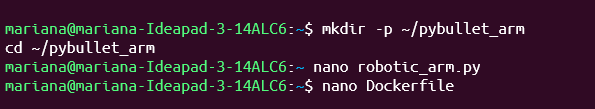
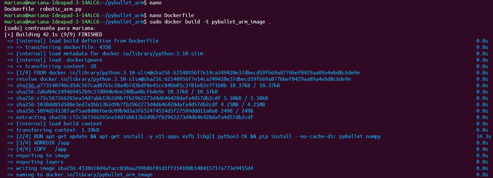
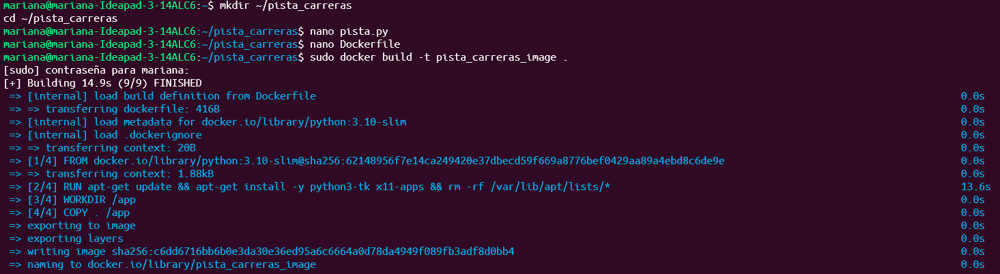
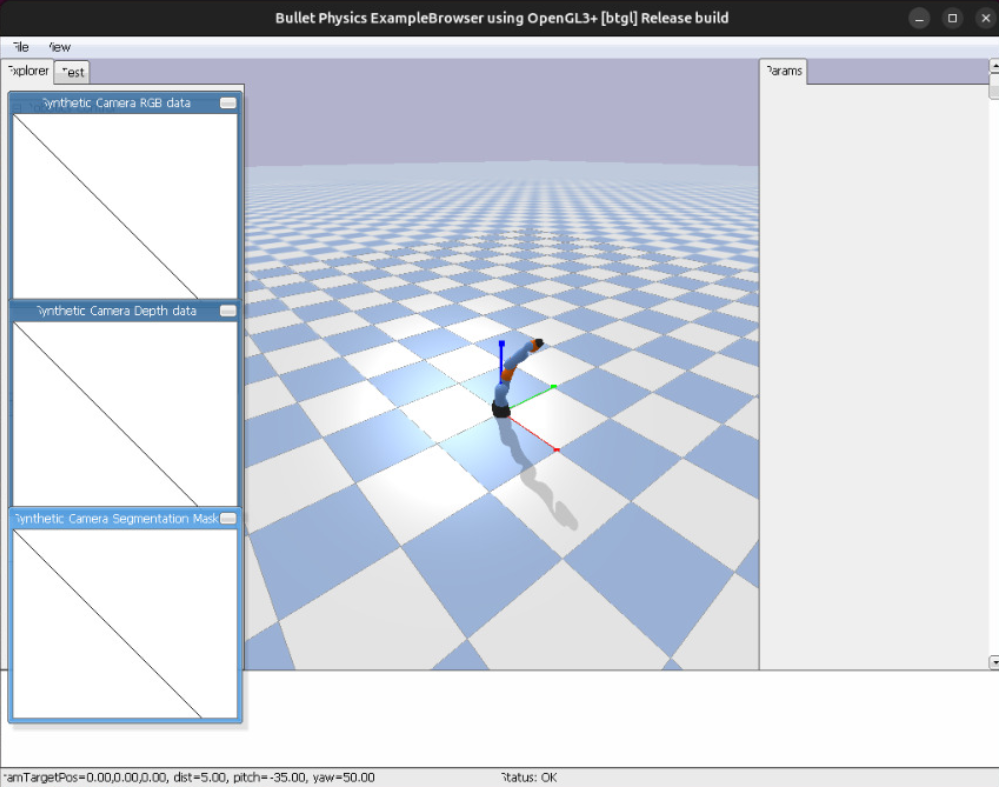
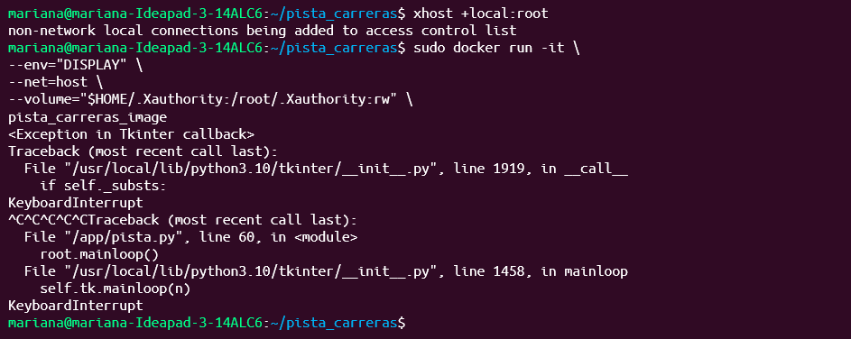

# Repositorio: Juegos-Digitales

Este repositorio contiene la estructura propuesta y el código base para crear un repositorio en GitHub que reúna **dos proyectos** (Brazo Robótico con PyBullet y Pista de Carreras con Tkinter) más un contenedor para los juegos (`juegos_digitales`). Incluye Dockerfiles listos para construir imágenes y un README con instrucciones.

## 1. Estructura general del proyecto

El proyecto está organizado en tres carpetas principales:

- **pybullet_arm** → Simulación de un brazo robótico con PyBullet  
- **pista_carreras** → Interfaz gráfica con una pista de carreras en Tkinter  
- **juegos_digitales** → Menú principal que permite lanzar ambos juegos  

---

## 2. Construcción de imágenes Docker

Cada aplicación se ejecuta dentro de su propio contenedor.  
Para construir las imágenes, se usa el siguiente proceso:

1. Abrir una terminal y ubicarse en la carpeta correspondiente  
2. Crear la imagen con el comando de construcción  

Ejemplo:  

docker build -t pybullet_arm_image ./pybullet_arm  
docker build -t pista_carreras_image ./pista_carreras  
docker build -t juegos_digitales_image ./juegos_digitales  

---

## 3. Ejecución de los contenedores

### 3.1. Simulación del Brazo Robótico

Este contenedor utiliza **PyBullet** para simular un brazo robótico con el modelo KUKA IIWA.  
El script permite mover una articulación con un movimiento senoidal.  
Además, se puede ejecutar en modo gráfico (GUI) o sin interfaz (Headless).

**Modo gráfico:**  
xhost +local:root  
sudo docker run --rm --net=host -e DISPLAY=$DISPLAY -v /tmp/.X11-unix:/tmp/.X11-unix pybullet_arm_image  

**Modo sin GUI (Headless):**  
sudo docker run --rm -e HEADLESS=1 pybullet_arm_image  

---

### 3.2. Pista de Carreras en Tkinter

Esta aplicación muestra una pista dibujada con elementos gráficos de Tkinter.  
Se ejecuta en una ventana dentro del entorno gráfico de Linux.

**Comando de ejecución:**  
xhost +local:root  
sudo docker run --rm --net=host -e DISPLAY=$DISPLAY -v /tmp/.X11-unix:/tmp/.X11-unix pista_carreras_image  

El código de esta aplicación incluye manejo de señales para evitar errores al cerrar la ventana desde la terminal (problema común con `KeyboardInterrupt`).

---

## 4. Archivos Dockerfile

Cada carpeta contiene su propio archivo **Dockerfile**, configurado para instalar las dependencias necesarias.

### Brazo Robótico  
- Imagen base: python:3.10-slim  
- Librerías: pybullet, numpy  
- Paquetes del sistema: xvfb, libgl, python3-tk  

### Pista de Carreras  
- Imagen base: python:3.10-slim  
- Paquetes del sistema: python3-tk, x11-apps  

### Menú de Juegos  
- Imagen base: python:3.10-slim  
- Paquetes del sistema: python3-tk  

---
## Proceso

---
