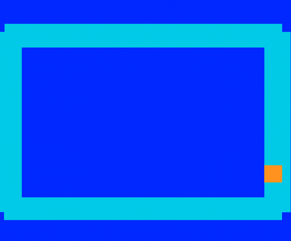

# Repositorio: Juegos-Digitales

Este repositorio contiene la estructura propuesta y el código base para crear un repositorio en GitHub que reúna **dos proyectos** (Brazo Robótico con PyBullet y Pista de Carreras con Tkinter) más un contenedor para los juegos (`juegos_digitales`). Incluye Dockerfiles listos para construir imágenes y un README con instrucciones.

---
## Proceso

(Agrega tus imágenes en `docs/` o en la sección de la wiki del repo)

---
